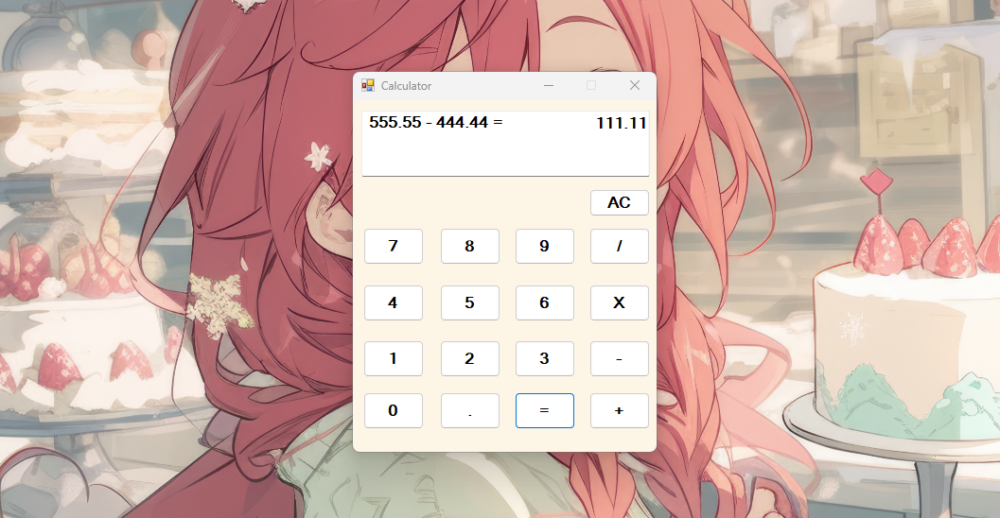

# Desktop-Based Calculator

This is a simple **Desktop-Based Calculator** built using **C#** and **Windows Forms**. It supports basic arithmetic operations like addition, subtraction, multiplication, and division, and displays both ongoing calculations and results.

## Features
- **Basic Arithmetic Operations**: Addition, Subtraction, Multiplication, Division
- **Ongoing Calculation Display**: The input and ongoing calculations are displayed in real-time.
- **Result Display**: Shows the result after performing calculations.
- **User-Friendly Interface**: Simple, easy-to-use buttons for input and output.

# Calculator App

This is a simple calculator app built using C# and Windows Forms.

## Screenshot



1. **Clone the repository to your local machine**:

   ```bash
   git clone https://github.com/your-username/Desktop-Based-Calculator.git
