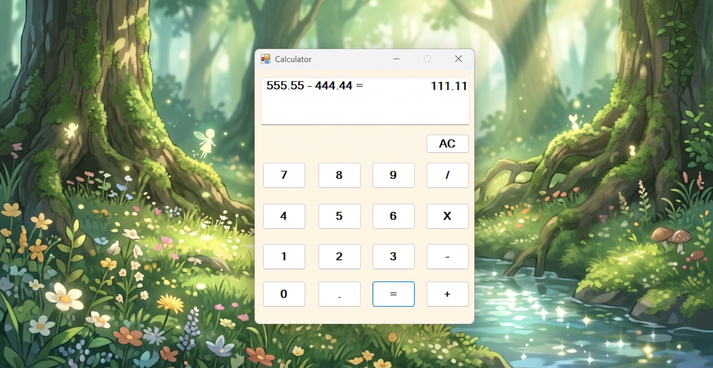

# Desktop-Based Calculator

This is a simple **Desktop-Based Calculator** developed using **C#** and **Windows Forms**. The application provides a clean and easy-to-use interface for performing basic arithmetic calculations.

## Features

- Addition
- Subtraction
- Multiplication
- Division
- Decimal number support
- Clear / reset function
- Displays the complete calculation and result
- Simple desktop user interface

## Technologies Used

- C#
- Windows Forms
- .NET Framework 4.8
- Visual Studio

## Project Structure

- `Class_Project.sln` - Visual Studio solution file
- `Class_Project.csproj` - C# project file
- `Form1.cs` - Main calculator logic
- `Form1.Designer.cs` - Windows Forms interface design
- `Program.cs` - Application entry point
- `Properties/` - Project resources and settings
- `Screenshots/` - Application screenshots

## Screenshot

### Calculator Main Interface

## Setup Instructions

1. Clone or download the repository.
2. Open `Class_Project.sln` in Visual Studio.
3. Make sure **.NET Framework 4.8** is available.
4. Build the solution.
5. Run the application.

## Usage

Enter numbers using the calculator buttons, select an arithmetic operator, enter the second number, and press `=` to view the result. Use `AC` to clear the current calculation.
